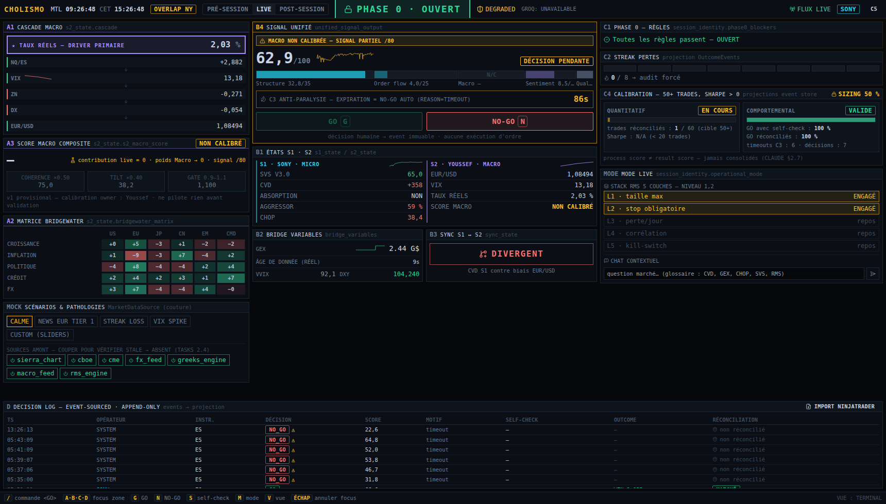
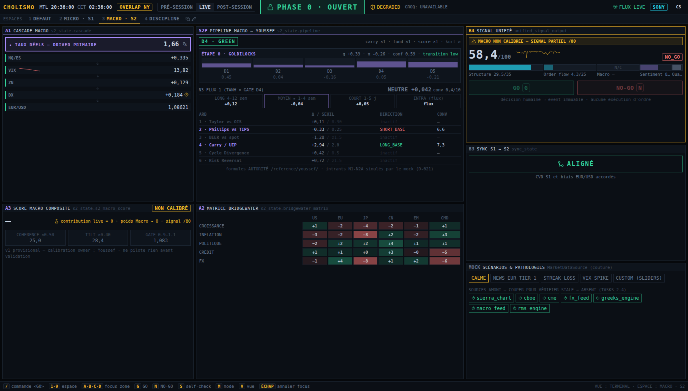

# CHOLISMO TERMINAL

Terminal de trading **human-in-the-loop** pour futures ES/NQ (microstructure) + EUR/USD
(macro FX). Deux opérateurs en miroir — **Sony (S1, cyan)** et **Youssef (S2, violet)** —
arbitrés par le **Router (or)**.

> Le terminal n'est pas un dashboard : c'est le rendu visuel direct du `ContextSchema v1.0`.
> **Un panneau = un bloc du schéma.** Objectif : 50+ trades disciplinés, Sharpe positif,
> preuve comportementale. Specs : [`CLAUDE.md`](CLAUDE.md) · [`PRD.md`](PRD.md) ·
> [`TASKS.md`](TASKS.md) · hypothèses : [`DECISIONS.md`](DECISIONS.md).

Le design s'inspire des grands terminaux financiers : densité et barre de touches
**Bloomberg**, tuiles liées **Eikon/FactSet**, pedigree de donnée **ICE** (badge
`FRESH/STALE/ABSENT` + âge réel sur chaque champ), « one language of risk » **Aladdin**
(un seul schéma source de vérité), blotter event-sourced **Murex/Calypso** (append-only,
l'état courant est une projection). Détail : `DECISIONS.md §D-000`.



---

## Lancer le stack

### Docker (recommandé)
```bash
docker compose up --build
# frontend  http://localhost:5173
# backend   http://localhost:8000        (REST + SSE)
# n8n       http://localhost:5678        (workflows dans orchestration/n8n/workflows/)
```

### Dev local
```bash
redis-server --daemonize yes
cd backend && python3 -m venv .venv && .venv/bin/pip install -r requirements.txt
.venv/bin/uvicorn app.main:app --port 8000
# autre terminal :
cd frontend && npm install && npm run dev    # http://localhost:5173
```

Deuxième instance opérateur (CLAUDE §9 — un opérateur par instance, backend partagé) :
`http://localhost:5173/?operator=YOUSSEF`.

## Utiliser le terminal

- **Clavier d'abord** : `A/B/C/D` focus zone · `G` GO · `N` NO-GO · `S` self-check C5 ·
  `M` cycle de mode · `V` cycle de vue (terminal / console orchestrateur / prompts) ·
  `Échap` annule. Les raccourcis sont affichés en bas d'écran.
- **Barre de commande** (lignée Bloomberg) : `/` ouvre la ligne, taper un mnémonique puis
  `⏎ <GO>` — `B4`, `C4`, `LIVE`, `PRE`, `ORCH`, `PROMPTS`, `CALME`, `VIX`, `GO`, `NOGO`,
  `SC`, `HELP`. Les commandes de décision passent par les mêmes verrous serveur que les
  boutons. Tick-flash vert/rouge sur les valeurs fraîches ; sparklines (score, CVD,
  EUR/USD, VIX, GEX) sur l'historique client des valeurs reçues par SSE.
- **Espaces de travail** (lignée Eikon) : onglets `DÉFAUT · MICRO · MACRO · DISCIPLINE`
  sous la barre de statut, bascule touches `1-9` ou mnémoniques (`MICRO`, `WS`, `WSRESET`).
  Dupliquer (icône copie) crée un espace `PERSO` ; le mode édition (crayon) permet de
  déplacer ◀▲▼▶ / masquer / réafficher les panneaux, renommer, et couper le blotter.
  Layouts persistés en localStorage, par opérateur. Un espace ne fait que réarranger les
  panneaux — chacun reste traçable à un bloc du schéma.
- **Prendre une décision** : passer en mode `LIVE` → remplir le self-check `C5` (`S`) →
  quand Phase 0 est `OUVERT` et le score ≥ 60, la fenêtre C3 (90 s) s'arme → `G`/`N`.
  À expiration : `NO_GO reason=timeout` écrit automatiquement. **Aucun ordre n'est jamais
  passé** — chaque décision est un event immuable du Decision Log (Zone D).
- **Prouver le comportement** : exporter les trades NinjaTrader (grille « Trades » → CSV)
  → `Import NinjaTrader` dans le blotter → chaque GO est matché par timestamp+instrument
  (`ReconEvent`), les anomalies `GO sans fill` / `fill sans GO` sont flaggées, le Sharpe
  (affiché à 20+ trades) et les deux jauges C4 avancent.

## Changer de scénario mock

Panneau `MOCK` (bas de la zone A) : **Calme · News EUR Tier 1 · Streak loss · VIX spike ·
Custom** (sliders VIX/CHOP/CVD/GEX/RMS), ou par API :
```bash
curl -X POST localhost:8000/scenario -H 'content-type: application/json' \
     -d '{"name":"vix_spike"}'                 # Phase 0 doit passer BLOQUÉ
curl -X POST localhost:8000/sources/sierra_chart/toggle \
     -H 'content-type: application/json' -d '{"up":false}'   # S1 → STALE puis ABSENT
```
Le mock injecte en continu les **pathologies réelles** (ticks manquants, retards, NaN,
valeurs contradictoires entre sources, désync d'horloge) — un mock propre est un piège
(CLAUDE §4). Les scénarios simulent aussi la fenêtre de session (`force_session`, D-020) ;
passer `"force_session": null` pour l'horloge réelle.

## Brancher un vrai feed

`MarketDataSource` est **l'unique couture** (`backend/app/datasource/base.py`) :

1. Implémenter `tick_fast()` / `tick_slow()` en écrivant les lectures via
   `RedisState.write_raw(field, value, source, ts)` — mêmes champs que
   `backend/app/engine.py::FIELD_SPEC` (le mapping champ → source → seuils de fraîcheur).
2. Remplacer `MockDataSource()` par votre implémentation dans `backend/app/main.py`.
3. Ne **jamais** inventer de valeur : pas de tick = pas d'écriture — le moteur classe
   la donnée `STALE` puis `ABSENT` et Phase 0 fail-close tout seul.

## Architecture

```
frontend (Vite+React+TS+Tailwind, store unique zustand)
   ▲  SSE « fast » (sub-seconde : s1, bridge, sync, signal, statut)
   ▲  SSE « slow » (15 s+ : s2/cascade/matrice — jamais re-poussée au tick micro)
backend FastAPI
   ├─ engine.py            hot path déterministe < 200 ms, zéro LLM synchrone
   ├─ phase0.py            verrou = booléens purs, fail-closed (Groq = advisory only)
   ├─ scoring.py           35/25/20/15/5, renormalisation /80 si macro non calibrée
   ├─ event_store.py       SQLite append-only (triggers RAISE ABORT sur UPDATE/DELETE)
   ├─ recon.py             CSV NinjaTrader → ReconEvent/OutcomeEvent → Sharpe
   ├─ ai/tasks.py          Groq/Claude/Gemini — async, bornés, loggés (ai_calls)
   └─ datasource/          interface swappable + mock pathologique
Redis  : état intra-session (raw, fenêtre C3, self-checks, acks, heartbeat)
SQLite : event store + snapshots (append-only)
n8n / LangGraph : orchestration hors hot path (Phase 0 appliquée AVANT tout appel Claude)
```

## Les 5 stratégies réelles (visibles dans le terminal)

Les artefacts des opérateurs vivent dans [`/reference/`](reference/MANIFEST.md) et sont
câblés dans le schéma (D-021) :

| Opérateur | Stratégie | Où c'est visible |
|---|---|---|
| Sony | **SVS — Structural Vacuum Squeeze** (breakout LVN, 09h30-11h00, seuil 88/100) | panneau `S1S` — éligibilité gate par gate + sizing VIX×session |
| Sony | **Mean Reversion — Piège d'Absorption v5.8** (15h30-17h00, seuil 80/100, CI > 61.8) | panneau `S1S` + stack RMS 5 couches canoniques (Mode Live) |
| Youssef | **Pipeline macro** (3 docs : Phase 0 kurtosis VIX → quadrant Bridgewater → N2A/N2B → N3 Flux 1+2 → N4/N5) | panneau `S2P` — régime D4, quadrant+poids, Flux 1, 6 arbitrages |

Formules AUTORITÉ ; intrants N1-N2A simulés par le mock tant qu'aucun feed réel n'est
branché. Extraits copiables dans l'onglet Prompts (`V`).



## Onglet Journal (`/` → `JOURNAL`)

Vue dédiée au journal de trading (transposition de `reference/journal/tradingjournal.html`,
D-022) : fiches par stratégie (SVS v3.0 · Mean Reversion · Macro Youssef) préremplies
CHOP/VIX depuis le schéma live, hiérarchie des sorties §06, « SL non respecté ⇒ erreur
Type A automatique », friction #2 quantifiée, sentiment pré/post-session par opérateur,
lockout dérivé (2 pertes → pause 24 h), export CSV/JSON, webhooks n8n
(`trade_closed`/`session_closed`). Brouillon Redis modifiable → **« Clôturer &
verrouiller » écrit une entrée append-only** — l'audit trail est immuable.

## Contraintes dures (CLAUDE §2) — où elles vivent

| # | Contrainte | Implémentation |
|---|---|---|
| 1 | Aucune exécution d'ordre | Aucun endpoint d'ordre ; `POST /decisions` ne fait qu'APPEND (`order_placed:false`) |
| 2 | Phase 0 déterministe, inviolable | `phase0.py` (booléens purs) ; re-vérifiée serveur sur GO (409) ; UI = reflet, fail-closed si flux muet |
| 3 | No signal without data | `meta.py` (NaN/absence → `ABSENT`, valeur retenue) + `MetaValue` (« PAS DE DONNÉES ») |
| 4 | Fail-closed par défaut | ROUGE sans action → `REQUEST_ACK` (`orchestrator.py`) ; erreur d'évaluation de règle → BLOQUÉ |
| 5 | Event store append-only | Triggers SQLite `RAISE(ABORT)` — même un bug ne peut pas UPDATE/DELETE |
| 6 | Discipline dans l'infra | C5 bloque le GO (HTTP 412), C3 timeout → NO_GO auto, audit streak à 8, sizing verrouillé 50 % |
| 7 | Process ≠ result score | Deux jauges C4 indépendantes ; Sharpe affiché à 20+ trades seulement |
| 8 | Claude jamais synchrone en live | `ai/tasks.py` : périodique/async, coût+latence loggés ; hot path 100 % déterministe |
